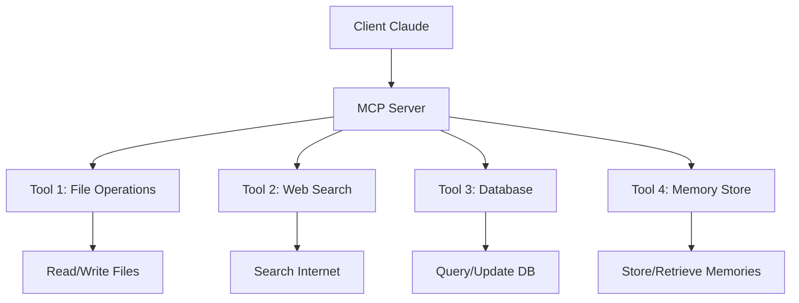
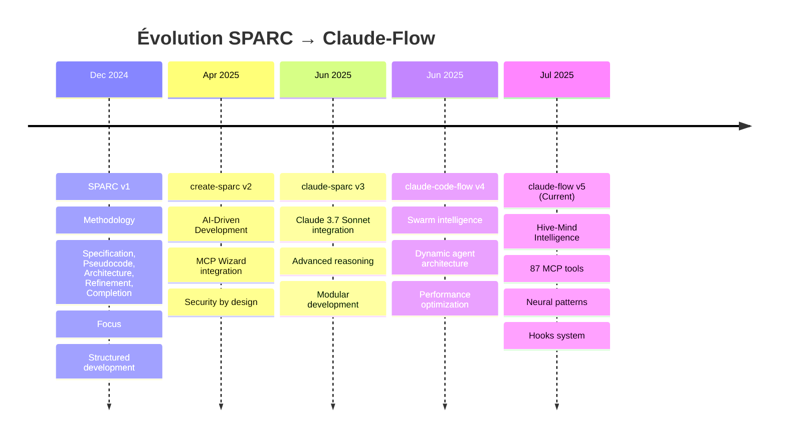
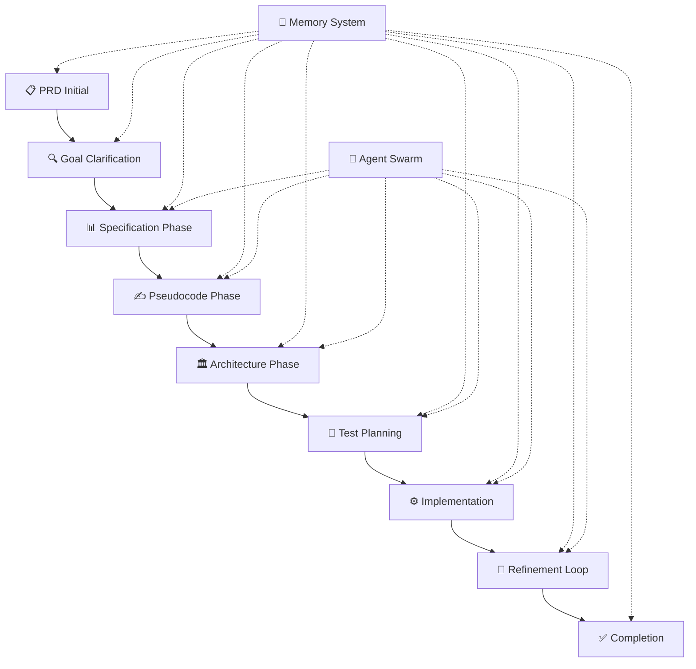

# Section 10-12 : Guide Complet de l'Orchestration Multi-Agents
*De la Théorie Enfantine aux Pipelines Professionnels*

## 🎯 Table des Matières

1. [L'Orchestration pour les Nuls (5 ans)](#orchestration-nuls)
2. [Comprendre les Systèmes Multi-Agents](#systemes-multi-agents)
3. [Le Protocole MCP Expliqué](#protocole-mcp)
4. [Évolution SPARC vers Claude-Flow](#evolution-sparc)
5. [Les Modes RooCode Détaillés](#modes-roocode)
6. [Pipeline Complet PRD → Implémentation](#pipeline-complet)
7. [Exemples Pratiques d'Orchestration](#exemples-pratiques)

---

## 🧸 L'Orchestration pour les Nuls (5 ans) {#orchestration-nuls}

### C'est Quoi l'Orchestration ?

Imagine que tu es le **chef d'une grande cuisine** 🧑‍🍳. Tu as plein de cuisiniers spécialisés :
- Un qui fait seulement les **entrées** 🥗
- Un qui fait les **plats principaux** 🍝
- Un qui fait les **desserts** 🍰
- Un qui s'occupe de la **décoration** 🎨

**L'orchestration, c'est toi qui diriges tous ces cuisiniers** pour faire un super repas !

### Dans le Monde des Ordinateurs

Au lieu de cuisiniers, on a des **"agents"** (des programmes intelligents) :
- **Agent Rechercheur** 🔍 : Il cherche des infos sur internet
- **Agent Codeur** 💻 : Il écrit du code
- **Agent Testeur** 🧪 : Il vérifie que tout marche
- **Agent Coordinateur** 🎯 : Il organise tout le monde

### Pourquoi C'est Magique ?

Sans orchestration :
```
Moi tout seul : 🙋‍♂️ → ⏰ 10 heures pour faire un site web
```

Avec orchestration :
```
Moi + 5 agents : 🙋‍♂️ + 🤖🤖🤖🤖🤖 → ⏰ 2 heures pour le même site !
```

**C'est comme avoir une équipe de super-héros qui travaillent ensemble !** 🦸‍♂️🦸‍♀️

---

## 🤖 Comprendre les Systèmes Multi-Agents {#systemes-multi-agents}

### CrewAI : L'Équipe de Pirates

**Concept Principal :** Comme un équipage de pirates, chaque agent a un rôle précis.

```python
# Exemple CrewAI Simple
crew = Crew(
    agents=[
        Agent(role="Capitaine", goal="Diriger l'équipe"),
        Agent(role="Navigateur", goal="Trouver la route"),
        Agent(role="Cuisinier", goal="Nourrir l'équipe")
    ],
    tasks=[
        Task(description="Planifier l'aventure"),
        Task(description="Naviguer vers l'île au trésor"),
        Task(description="Préparer les provisions")
    ]
)
```

**Avantages :**
- ✅ Simple à comprendre
- ✅ Chaque agent a un rôle clair
- ✅ Communication structurée

**Inconvénients :**
- ❌ Difficile à faire grandir
- ❌ Pas très flexible
- ❌ Communication limitée

### AutoGen : La Conversation Intelligente

**Concept Principal :** Les agents parlent ensemble comme dans une réunion.

```python
# Exemple AutoGen
user_proxy = UserProxyAgent("Utilisateur")
assistant = AssistantAgent("Assistant")
critic = AssistantAgent("Critique")

# Conversation automatique
user_proxy.initiate_chat(
    assistant,
    message="Crée un site web de vente en ligne"
)
```

**Avantages :**
- ✅ Conversation naturelle
- ✅ Feedback automatique
- ✅ Amélioration continue

**Inconvénients :**
- ❌ Peut partir dans tous les sens
- ❌ Difficile à contrôler
- ❌ Coûteux en tokens

### MCP : Le Système Nerveux

**Concept Principal :** Un protocole universel pour que tous les agents communiquent.

```json
{
  "method": "tools/call",
  "params": {
    "name": "code_writer",
    "arguments": {
      "file": "index.html",
      "content": "<html>...</html>"
    }
  }
}
```

**Avantages :**
- ✅ Standard universel
- ✅ Extensible à l'infini
- ✅ Sécurité renforcée
- ✅ Interopérabilité

---

## 🔌 Le Protocole MCP Expliqué {#protocole-mcp}

### Qu'est-ce que MCP ?

**MCP (Model Context Protocol)** est comme le **système nerveux** d'un corps humain. Il permet à différentes parties (agents) de communiquer entre elles.

### Architecture MCP



### Configuration MCP Simple

**1. Installation :**
```bash
# Ajouter un serveur MCP à Claude Code
claude mcp add claude-flow npx claude-flow mcp start
```

**2. Configuration dans `.claude/settings.json` :**
```json
{
  "mcpServers": {
    "claude-flow": {
      "command": "npx",
      "args": ["claude-flow", "mcp", "start"],
      "alwaysAllow": [
        "swarm_init",
        "agent_spawn",
        "task_orchestrate"
      ]
    }
  }
}
```

### Outils MCP Claude-Flow Essentiels

#### 🐝 Orchestration de Swarm (15 outils)
```javascript
// Initialiser un swarm
mcp__claude-flow__swarm_init({
  topology: "mesh",        // mesh, hierarchical, ring, star
  maxAgents: 8,
  strategy: "parallel"
})

// Créer des agents spécialisés
mcp__claude-flow__agent_spawn({
  type: "researcher",      // researcher, coder, analyst, tester, etc.
  name: "Data Analyst",
  capabilities: ["data_analysis", "visualization"]
})

// Orchestrer des tâches
mcp__claude-flow__task_orchestrate({
  task: "Build REST API with authentication",
  strategy: "parallel",    // parallel, sequential, adaptive
  dependencies: ["database_setup", "auth_config"]
})
```

#### 🧠 Neural & Cognitive (12 outils)
```javascript
// Entraîner des patterns
mcp__claude-flow__neural_train({
  pattern_type: "coordination",
  training_data: "successful_project_patterns",
  epochs: 50
})

// Analyse cognitive
mcp__claude-flow__cognitive_analyze({
  behavior: "debugging_approach"
})
```

#### 💾 Gestion Mémoire (10 outils)
```javascript
// Stocker des informations persistantes
mcp__claude-flow__memory_usage({
  action: "store",
  key: "project/architecture",
  value: JSON.stringify({
    database: "PostgreSQL",
    api: "FastAPI",
    frontend: "React"
  }),
  ttl: 86400  // 24 heures
})

// Rechercher dans la mémoire
mcp__claude-flow__memory_search({
  pattern: "authentication*",
  limit: 10
})
```

### Exemple Concret MCP

**Scénario :** Créer un système d'authentification

```javascript
// 1. Initialiser le swarm
await mcp__claude-flow__swarm_init({
  topology: "hierarchical",
  maxAgents: 5
});

// 2. Spawner les agents spécialisés
await Promise.all([
  mcp__claude-flow__agent_spawn({ type: "architect", name: "Auth Designer" }),
  mcp__claude-flow__agent_spawn({ type: "coder", name: "Backend Dev" }),
  mcp__claude-flow__agent_spawn({ type: "coder", name: "Frontend Dev" }),
  mcp__claude-flow__agent_spawn({ type: "tester", name: "Security Tester" }),
  mcp__claude-flow__agent_spawn({ type: "coordinator", name: "Project Manager" })
]);

// 3. Orchestrer la tâche
await mcp__claude-flow__task_orchestrate({
  task: "Implement JWT authentication system",
  strategy: "parallel",
  dependencies: []
});

// 4. Stocker le contexte
await mcp__claude-flow__memory_usage({
  action: "store",
  key: "auth/requirements",
  value: JSON.stringify({
    jwt: true,
    refresh_tokens: true,
    password_hashing: "bcrypt",
    rate_limiting: true
  })
});
```

---

## 🚀 Évolution SPARC vers Claude-Flow {#evolution-sparc}

### Chronologie de l'Évolution



### SPARC : La Méthodologie de Base

**S.P.A.R.C** = **S**pecification → **P**seudocode → **A**rchitecture → **R**efinement → **C**ompletion

```
📋 Specification
   ↓
✍️ Pseudocode
   ↓
🏛️ Architecture
   ↓
🔧 Refinement
   ↓
✅ Completion
```

**Exemple SPARC Traditionnel :**
```
SPECIFICATION: "Créer un système de chat"
PSEUDOCODE: 
  - connecter_utilisateur()
  - envoyer_message()
  - recevoir_message()
ARCHITECTURE: WebSocket + Redis + PostgreSQL
REFINEMENT: Optimiser performance, sécurité
COMPLETION: Tests, déploiement, documentation
```

### Claude-Flow : La Révolution

**Claude-Flow transforme SPARC avec :**

#### 🐝 Hive-Mind Intelligence
- **Queen AI** : Coordonne tous les worker agents
- **Worker Agents** : Spécialisés par domaine (Architect, Coder, Tester, etc.)
- **Communication** : Protocole MCP standardisé

#### 🧠 Neural Patterns
- **27+ modèles neuraux** avec accélération WASM SIMD
- **Apprentissage adaptatif** des patterns de développement
- **Reconnaissance de patterns** pour optimiser les approches

#### 🔗 Advanced Hooks System
```bash
# Pre-operation hooks
npx claude-flow hooks pre-task --description "auth system"
npx claude-flow hooks pre-search --query "JWT best practices"

# Post-operation hooks  
npx claude-flow hooks post-edit --file "auth.py"
npx claude-flow hooks post-task --task-id "auth-001"

# Session management
npx claude-flow hooks session-restore --session-id "project-123"
npx claude-flow hooks session-end --export-metrics true
```

### Transformation Concrète

**AVANT (SPARC traditionnel) :**
```
👨‍💻 Développeur seul
⏰ 5 jours pour un système d'auth
🐛 Beaucoup d'erreurs manuelles
📝 Documentation incomplète
```

**APRÈS (Claude-Flow) :**
```
👨‍💻 Développeur + Swarm de 6 agents
⏰ 1 jour pour le même système
🧠 Intelligence collective
📝 Documentation auto-générée
🔍 Tests automatiques
🛡️ Sécurité by design
```

---

## 🎭 Les Modes RooCode Détaillés {#modes-roocode}

### Vue d'Ensemble des Modes

Les **RooCode Modes** sont des **personnalités AI spécialisées** avec des outils et instructions spécifiques.

### 🎯 Modes Orchestrateurs

#### 1. **uber-orchestrator** (Le Chef Supreme)
```json
{
  "role": "Entrusted with overall project goal",
  "superpowers": [
    "Analyzes project state at granular level",
    "Intelligently delegates to appropriate SPARC phase",
    "Manages SPARC lifecycle sequencing"
  ],
  "tools": ["read", "mcp"],
  "workflow": "Information Gathering → State Analysis → User Approval → Task Delegation"
}
```

**Exemple d'utilisation :**
```
Utilisateur: "Je veux créer une app de e-commerce"
Uber-orchestrator: 
1. 🔍 Analyse le state actuel (database queries)
2. 🤔 Détermine: "Pas de Mutual_Understanding_Document.md"
3. 🎯 Délègue à: "orchestrator-goal-clarification"
4. ✅ Demande approbation utilisateur
```

#### 2. **orchestrator-state-scribe** (Le Gardien de la Mémoire)
```json
{
  "role": "Dedicated manager of project's evolving state",
  "superpowers": [
    "Transforms natural language → structured records",
    "Maintains granular project memory",
    "Tracks every class, function, variable"
  ],
  "database": "Supabase project_memorys table"
}
```

#### 3. **swarm-coordinator** (Le Maestro des Agents)
```json
{
  "tools": ["TodoWrite", "Task", "Memory", "Bash"],
  "specialty": "Coordinates swarms of AI agents",
  "workflow": "Task Management → Agent Launching → Memory Coordination"
}
```

### 🎨 Modes Spécialisés

#### Modes SPARC Phase-Specific

**orchestrator-sparc-specification-phase :**
```
Mission: Extreme granularity specifications
Workflow: Research → Examples → Comprehensive Specs → Review → Documentation
Output: Every class, function, method, variable defined
```

**orchestrator-sparc-pseudocode-phase :**
```
Mission: Language-agnostic pseudocode for every function
Workflow: Retrieve Specs → Generate Pseudocode → Advocate Review → Refinement
Output: Detailed function-by-function pseudocode
```

**orchestrator-sparc-architecture-phase :**
```
Mission: System architecture organizing classes/functions into modules
Workflow: Analysis → Design → User Review → Advocate Review → Boilerplate
Output: Complete system architecture + relationships
```

#### Modes de Développement

**coder :**
```json
{
  "description": "Autonomous code generation and implementation",
  "tools": ["Read", "Write", "Edit", "Bash", "Glob", "Grep"],
  "focus": "Clean, efficient, well-documented code",
  "approach": "Batch file operations"
}
```

**tdd :**
```json
{
  "description": "Test-driven development methodology",
  "tools": ["Read", "Write", "Edit", "Bash", "TodoWrite", "Task"],
  "workflow": "Test Planning → Test Execution → Code Implementation"
}
```

**debugger :**
```json
{
  "description": "Debug and fix issues systematically",
  "tools": ["Read", "Edit", "Bash", "Grep", "TodoWrite", "Memory"],
  "approach": "Systematic debugging + Memory for tracking patterns"
}
```

### 🏗️ Comment Ajouter un Mode Personnalisé

**1. Structure de base :**
```json
{
  "slug": "mon-mode-custom",
  "name": "Mon Mode Spécialisé",
  "roleDefinition": "Description détaillée du rôle...",
  "customInstructions": "Instructions spécifiques step-by-step...",
  "groups": ["read", "edit", "mcp"],
  "source": "project"
}
```

**2. Exemple complet - Mode "API Designer" :**
```json
{
  "slug": "api-designer",
  "name": "🔌 API Designer Specialist",
  "roleDefinition": "You are an expert API designer focused on creating RESTful APIs with best practices, security, and documentation.",
  "customInstructions": "Your workflow: 1) Analyze requirements 2) Design endpoints 3) Define schemas 4) Add security 5) Generate OpenAPI docs 6) Create tests. Always follow REST principles and include proper error handling.",
  "groups": ["read", "write", "edit"],
  "tools": [
    "Read", "Write", "Edit", "WebSearch", "TodoWrite"
  ],
  "specializations": [
    "OpenAPI/Swagger documentation",
    "REST best practices",
    "Authentication/Authorization",
    "Error handling patterns",
    "API versioning strategies"
  ]
}
```

### 🎪 Intégration avec Claude-Flow

**Utilisation avec MCP :**
```javascript
// 1. Activer un mode spécifique
await mcp__claude-flow__sparc_mode({
  mode: "api",
  task_description: "Design user authentication API",
  options: {
    include_security: true,
    generate_docs: true,
    add_tests: true
  }
});

// 2. Coordonner avec d'autres agents
await mcp__claude-flow__agent_spawn({
  type: "specialist",
  mode: "api-designer",
  task: "Design payment gateway endpoints"
});
```

---

## 🏗️ Pipeline Complet PRD → Implémentation {#pipeline-complet}

### Vue d'Ensemble du Pipeline



### Phase 1 : Initialisation et Clarification

#### Input : PRD Basique
```markdown
# PRD : Plateforme E-commerce
**Objectif :** Créer une plateforme de vente en ligne pour PME
**Utilisateurs :** Vendeurs et acheteurs
**Features :** Catalogue, panier, paiement, gestion commandes
```

#### Processus Claude-Flow :
```javascript
// 1. Initialiser le système
await mcp__claude-flow__swarm_init({
  topology: "hierarchical",
  maxAgents: 8,
  strategy: "adaptive"
});

// 2. Spawner l'équipe de clarification
await Promise.all([
  mcp__claude-flow__agent_spawn({
    type: "analyst", 
    name: "Requirements Analyst",
    mode: "orchestrator-goal-clarification"
  }),
  mcp__claude-flow__agent_spawn({
    type: "researcher", 
    name: "Market Researcher"
  })
]);

// 3. Orchestrer la clarification
await mcp__claude-flow__task_orchestrate({
  task: "Clarify e-commerce platform requirements",
  strategy: "sequential",
  deliverables: [
    "Mutual_Understanding_Document.md",
    "constraints_and_anti_goals.md"
  ]
});
```

#### Output : Documents Structurés
```
📁 docs/
├── 📄 Mutual_Understanding_Document.md
│   ├── Project Overview
│   ├── Problem Statement
│   ├── Stakeholder Analysis
│   ├── User Stories with Acceptance Criteria
│   └── SMART Success Criteria
├── 📄 constraints_and_anti_goals.md
│   ├── Technical Constraints
│   ├── Business Constraints
│   └── Anti-Goals with Rationale
└── 📄 user_preferences.json
```

### Phase 2 : Specification Granulaire

#### Processus Orchestré :
```javascript
// Spawner l'équipe de spécification
await Promise.all([
  mcp__claude-flow__agent_spawn({
    type: "researcher",
    name: "Strategic Planner",
    mode: "research-planner-strategic"
  }),
  mcp__claude-flow__agent_spawn({
    type: "analyst",
    name: "Spec Writer",
    mode: "spec-writer-comprehensive"
  }),
  mcp__claude-flow__agent_spawn({
    type: "reviewer",
    name: "Devil's Advocate",
    mode: "devils-advocate-critical-evaluator"
  })
]);
```

#### Output : Spécifications Techniques
```
📁 docs/specifications/
├── 📄 user_management_spec.md
│   ├── UserClass
│   │   ├── register(email, password, profile) -> User
│   │   ├── authenticate(email, password) -> Token
│   │   └── updateProfile(userId, profileData) -> Boolean
│   ├── AuthService
│   │   ├── generateJWT(user) -> String
│   │   ├── validateToken(token) -> Boolean
│   │   └── refreshToken(oldToken) -> String
├── 📄 product_catalog_spec.md
├── 📄 order_management_spec.md
└── 📄 payment_system_spec.md
```

### Phase 3 : Architecture et Pseudocode

#### Architecture Design :
```javascript
await mcp__claude-flow__agent_spawn({
  type: "architect",
  name: "System Architect",
  mode: "architect-highlevel-module"
});

await mcp__claude-flow__task_orchestrate({
  task: "Design microservices architecture for e-commerce",
  context: "specs from previous phase",
  deliverables: [
    "system_architecture.md",
    "service_interactions.md",
    "database_schema.md"
  ]
});
```

#### Pseudocode Generation :
```javascript
await mcp__claude-flow__agent_spawn({
  type: "coder",
  name: "Pseudocode Writer",
  mode: "pseudocode-writer"
});

// Pour chaque fonction spécifiée
await mcp__claude-flow__task_orchestrate({
  task: "Generate detailed pseudocode for all specified functions",
  strategy: "parallel",
  granularity: "function-level"
});
```

#### Output : Architecture Complète
```
📁 docs/architecture/
├── 📄 system_overview.md
├── 📄 microservices_design.md
│   ├── 🔧 user-service
│   ├── 🛒 product-service  
│   ├── 💰 payment-service
│   ├── 📦 order-service
│   └── 🔔 notification-service
├── 📄 database_schema.md
├── 📄 api_contracts.md
└── 📁 pseudocode/
    ├── user_service_pseudo.md
    ├── product_service_pseudo.md
    └── payment_service_pseudo.md
```

### Phase 4 : Implémentation Orchestrée

#### Test-Driven Development :
```javascript
// 1. Créer les tests fonctionnels
await mcp__claude-flow__agent_spawn({
  type: "tester",
  name: "TDD Master",
  mode: "tester-tdd-master"
});

await mcp__claude-flow__task_orchestrate({
  task: "Create functional tests for user authentication feature",
  inputs: {
    specification: "docs/specifications/user_management_spec.md",
    pseudocode: "docs/pseudocode/user_service_pseudo.md"
  }
});

// 2. Implémenter le code
await mcp__claude-flow__agent_spawn({
  type: "coder",
  name: "Backend Developer",
  mode: "coder-test-driven"
});

await mcp__claude-flow__task_orchestrate({
  task: "Implement user authentication functions to pass tests",
  approach: "TDD cycle: Red → Green → Refactor"
});
```

#### Parallel Development :
```javascript
// Développement en parallèle de tous les services
await mcp__claude-flow__parallel_execute({
  tasks: [
    {
      agent: "backend-dev-1",
      task: "Implement user-service",
      tests: "tests/user_service_test.py"
    },
    {
      agent: "backend-dev-2", 
      task: "Implement product-service",
      tests: "tests/product_service_test.py"
    },
    {
      agent: "frontend-dev-1",
      task: "Implement user interface",
      tests: "tests/ui_test.spec.js"
    },
    {
      agent: "devops-specialist",
      task: "Setup CI/CD pipeline",
      tests: "tests/deployment_test.yml"
    }
  ]
});
```

### Phase 5 : Refinement et Quality Assurance

#### Multi-Agent Review :
```javascript
await Promise.all([
  mcp__claude-flow__agent_spawn({
    type: "reviewer",
    name: "Security Reviewer", 
    mode: "security-reviewer-module"
  }),
  mcp__claude-flow__agent_spawn({
    type: "optimizer",
    name: "Performance Optimizer",
    mode: "optimizer-module"
  }),
  mcp__claude-flow__agent_spawn({
    type: "tester",
    name: "Integration Tester"
  })
]);

await mcp__claude-flow__task_orchestrate({
  task: "Complete quality assurance cycle",
  strategy: "parallel",
  phases: [
    "security_audit",
    "performance_optimization", 
    "integration_testing",
    "user_acceptance_testing"
  ]
});
```

### Phase 6 : Documentation et Finalisation

#### Auto-Documentation :
```javascript
await mcp__claude-flow__agent_spawn({
  type: "documenter",
  name: "Technical Writer",
  mode: "docs-writer-feature"
});

await mcp__claude-flow__workflow_execute({
  workflowId: "documentation-pipeline",
  params: {
    codebase: "src/",
    output: "docs/",
    formats: ["markdown", "openapi", "jsdoc"]
  }
});
```

### Tracking et Mémoire Persistante

#### Système de Mémoire :
```javascript
// Stocker l'état à chaque phase
await mcp__claude-flow__memory_usage({
  action: "store",
  key: "project/phase/specification",
  value: JSON.stringify({
    completed: true,
    deliverables: [
      "user_management_spec.md",
      "product_catalog_spec.md"
    ],
    nextPhase: "pseudocode",
    lessons: ["Need more granular user stories", "Security requirements unclear"]
  }),
  namespace: "ecommerce-project"
});

// Analytics et métriques
await mcp__claude-flow__performance_report({
  format: "detailed",
  timeframe: "7d"
});
```

### Output Final : Système Complet

```
🏪 E-commerce Platform/
├── 📁 backend/
│   ├── 🔧 user-service/
│   ├── 🛒 product-service/
│   ├── 💰 payment-service/
│   └── 📦 order-service/
├── 📁 frontend/
│   ├── ⚛️ React components
│   ├── 🎨 UI/UX implementation
│   └── 🔒 Authentication flows
├── 📁 tests/
│   ├── 🧪 Unit tests (100% coverage)
│   ├── 🔗 Integration tests
│   └── 🎭 E2E tests
├── 📁 docs/
│   ├── 📖 API documentation
│   ├── 🏗️ Architecture diagrams
│   └── 👥 User manuals
├── 📁 infrastructure/
│   ├── 🐳 Docker containers
│   ├── ☸️ Kubernetes configs
│   └── 🚀 CI/CD pipelines
└── ✅ Production-ready system
```

---

## 🎪 Exemples Pratiques d'Orchestration {#exemples-pratiques}

### Exemple 1 : API REST Complète en 2 Heures

#### Contexte
**Objectif :** Créer une API REST pour gestion de tâches avec authentification JWT

#### Setup Initial (5 minutes)
```javascript
// 1. Initialisation du swarm
await mcp__claude-flow__swarm_init({
  topology: "mesh",
  maxAgents: 6,
  strategy: "parallel"
});

// 2. Création de l'équipe spécialisée
await Promise.all([
  mcp__claude-flow__agent_spawn({
    type: "architect",
    name: "API Designer",
    capabilities: ["rest_design", "openapi", "security"]
  }),
  mcp__claude-flow__agent_spawn({
    type: "coder", 
    name: "Backend Dev",
    capabilities: ["python", "fastapi", "sqlalchemy"]
  }),
  mcp__claude-flow__agent_spawn({
    type: "tester",
    name: "API Tester", 
    capabilities: ["pytest", "postman", "security_testing"]
  }),
  mcp__claude-flow__agent_spawn({
    type: "reviewer",
    name: "Security Auditor",
    capabilities: ["security_review", "jwt", "owasp"]
  }),
  mcp__claude-flow__agent_spawn({
    type: "documenter",
    name: "Doc Writer",
    capabilities: ["openapi", "markdown", "tutorials"]
  })
]);
```

#### Phase Design (20 minutes)
```javascript
// Orchestration du design
await mcp__claude-flow__task_orchestrate({
  task: "Design complete TODO API with authentication",
  strategy: "sequential",
  dependencies: [],
  deliverables: [
    "api_specification.md",
    "database_schema.md", 
    "authentication_strategy.md",
    "openapi_spec.yaml"
  ]
});

// Mémoire partagée du design
await mcp__claude-flow__memory_usage({
  action: "store",
  key: "todo-api/design",
  value: JSON.stringify({
    endpoints: {
      auth: ["/login", "/register", "/refresh"],
      todos: ["/todos", "/todos/:id", "/todos/:id/complete"],
      users: ["/users/profile", "/users/settings"]
    },
    database: {
      tables: ["users", "todos", "sessions"],
      relationships: "users -> todos (1:many)"
    },
    security: {
      jwt: true,
      refresh_tokens: true,
      rate_limiting: true,
      input_validation: true
    }
  })
});
```

#### Phase Implémentation (60 minutes)
```javascript
// Développement parallèle
await mcp__claude-flow__parallel_execute({
  tasks: [
    {
      agent: "Backend Dev",
      task: "Implement authentication endpoints",
      files: ["auth.py", "models.py", "schemas.py"],
      tests: "tests/test_auth.py"
    },
    {
      agent: "Backend Dev", 
      task: "Implement CRUD operations for todos",
      files: ["todos.py", "crud.py"],
      tests: "tests/test_todos.py"
    },
    {
      agent: "API Tester",
      task: "Create comprehensive test suite",
      files: ["tests/", "postman_collection.json"],
      coverage_target: "95%"
    }
  ]
});

// Monitoring en temps réel
await mcp__claude-flow__swarm_monitor({
  interval: 30000,  // 30 secondes
  metrics: ["progress", "errors", "performance"]
});
```

#### Phase Qualité (30 minutes)
```javascript
// Review et optimisation
await Promise.all([
  mcp__claude-flow__task_orchestrate({
    task: "Security audit of implemented API",
    agent: "Security Auditor",
    focus: ["jwt_security", "input_validation", "sql_injection", "xss"]
  }),
  mcp__claude-flow__task_orchestrate({
    task: "Performance optimization",
    agent: "Backend Dev", 
    metrics: ["response_time", "memory_usage", "db_queries"]
  }),
  mcp__claude-flow__task_orchestrate({
    task: "Generate complete documentation",
    agent: "Doc Writer",
    formats: ["openapi", "postman", "readme", "tutorials"]
  })
]);
```

#### Résultat Final (5 minutes)
```
✅ API REST Complète :
├── 🔐 Authentication (JWT + Refresh tokens)
├── 📝 CRUD Todos (Create, Read, Update, Delete)
├── 👤 User Management 
├── 🧪 Tests (98% coverage)
├── 🛡️ Security Audit (Passed)
├── 📊 Performance (< 100ms response time)
└── 📖 Documentation (OpenAPI + Tutorials)

⏱️ Temps total : 2h00
🤖 Agents impliqués : 5
🚀 Production-ready : Oui
```

### Exemple 2 : Debugging Complexe avec Swarm

#### Contexte : Bug de Performance Mystérieux

**Problème :** Application React qui ralentit après 10 minutes d'utilisation

#### Diagnostic Orchestré (15 minutes)
```javascript
// 1. Équipe de diagnostic
await Promise.all([
  mcp__claude-flow__agent_spawn({
    type: "analyzer",
    name: "Performance Profiler",
    capabilities: ["memory_analysis", "cpu_profiling", "network_analysis"]
  }),
  mcp__claude-flow__agent_spawn({
    type: "debugger", 
    name: "Memory Detective",
    capabilities: ["memory_leaks", "garbage_collection", "dom_analysis"]
  }),
  mcp__claude-flow__agent_spawn({
    type: "reviewer",
    name: "Code Auditor",
    capabilities: ["code_review", "anti_patterns", "react_best_practices"]
  })
]);

// 2. Analyse parallèle
await mcp__claude-flow__parallel_execute({
  tasks: [
    {
      agent: "Performance Profiler",
      task: "Profile application performance over 15 minutes",
      tools: ["Chrome DevTools", "React Profiler", "Lighthouse"]
    },
    {
      agent: "Memory Detective", 
      task: "Detect memory leaks and retention patterns",
      focus: ["event_listeners", "closures", "dom_nodes", "react_components"]
    },
    {
      agent: "Code Auditor",
      task: "Review codebase for performance anti-patterns",
      patterns: ["unnecessary_renders", "large_lists", "inefficient_updates"]
    }
  ]
});
```

#### Findings Coordonnés
```javascript
// Aggregation des découvertes
await mcp__claude-flow__memory_usage({
  action: "store",
  key: "debug/findings",
  value: JSON.stringify({
    performance_profiler: {
      memory_growth: "5MB every 2 minutes",
      cpu_spikes: "During scroll events",
      network: "Normal"
    },
    memory_detective: {
      leak_sources: [
        "Event listeners not cleaned on component unmount",
        "Large objects retained in closure",
        "DOM nodes not garbage collected"
      ],
      critical_components: ["DataTable", "InfiniteScroll", "ChatWidget"]
    },
    code_auditor: {
      anti_patterns: [
        "Missing React.memo for expensive components", 
        "Creating objects in render functions",
        "Not using useCallback for event handlers"
      ]
    }
  })
});
```

#### Solution Orchestrée (45 minutes)
```javascript
// 1. Plan de correction coordonné
await mcp__claude-flow__task_orchestrate({
  task: "Fix identified performance issues",
  strategy: "parallel",
  priority: "critical"
});

// 2. Corrections parallèles
await mcp__claude-flow__parallel_execute({
  tasks: [
    {
      agent: "React Optimizer",
      task: "Optimize DataTable component",
      fixes: [
        "Add React.memo",
        "Implement virtualization for large lists", 
        "Use useCallback for event handlers"
      ]
    },
    {
      agent: "Memory Fixer",
      task: "Fix memory leaks",
      fixes: [
        "Add cleanup in useEffect",
        "Remove event listeners on unmount",
        "Clear timers and intervals"
      ]
    },
    {
      agent: "Performance Tester",
      task: "Validate fixes with performance tests",
      metrics: ["memory_usage", "render_time", "scroll_performance"]
    }
  ]
});
```

#### Validation et Monitoring
```javascript
// Tests de régression
await mcp__claude-flow__task_orchestrate({
  task: "Run comprehensive performance validation",
  duration: "30 minutes continuous testing",
  metrics: {
    memory_growth: "< 1MB over 30 minutes",
    render_time: "< 16ms for 60fps",
    user_interactions: "< 100ms response time"
  }
});

// Rapport final
await mcp__claude-flow__performance_report({
  format: "detailed",
  comparison: "before_vs_after",
  include: ["memory_charts", "performance_metrics", "code_changes"]
});
```

#### Résultat
```
🐛 Bug Performance Résolu :
├── 🔍 Diagnostic : 15 minutes (3 agents en parallèle)
├── 🛠️ Correction : 45 minutes (3 fixes simultanées)  
├── ✅ Validation : 30 minutes (tests automatisés)
└── 📊 Amélioration : 
    ├── Mémoire : -80% de consommation
    ├── Rendu : +200% plus fluide
    └── Réactivité : +150% plus rapide

⏱️ Temps total : 1h30 (vs 1 journée en solo)
🎯 Efficacité : 5x plus rapide
```

### Exemple 3 : Migration Legacy vers Microservices

#### Contexte
**Challenge :** Migrer un monolithe PHP vers architecture microservices Node.js

#### Phase d'Analyse (1 jour)
```javascript
// 1. Équipe d'analyse du legacy
await Promise.all([
  mcp__claude-flow__agent_spawn({
    type: "analyzer",
    name: "Legacy Archaeologist", 
    capabilities: ["php_analysis", "database_reverse_engineering", "dependency_mapping"]
  }),
  mcp__claude-flow__agent_spawn({
    type: "architect",
    name: "Microservices Designer",
    capabilities: ["domain_modeling", "service_boundaries", "api_design"]
  }),
  mcp__claude-flow__agent_spawn({
    type: "researcher",
    name: "Technology Evaluator",
    capabilities: ["tech_stack_analysis", "performance_comparison", "migration_strategies"]
  })
]);

// 2. Analyse complète du système existant
await mcp__claude-flow__task_orchestrate({
  task: "Complete legacy system analysis",
  strategy: "parallel",
  deliverables: [
    "codebase_map.md",
    "database_schema_analysis.md", 
    "business_logic_extraction.md",
    "integration_points.md",
    "performance_baseline.md"
  ]
});

// 3. Design de la nouvelle architecture
await mcp__claude-flow__task_orchestrate({
  task: "Design microservices architecture",
  inputs: "legacy_analysis_results",
  strategy: "domain_driven_design",
  deliverables: [
    "service_boundaries.md",
    "api_contracts.md",
    "data_migration_strategy.md",
    "deployment_architecture.md"
  ]
});
```

#### Phase de Migration (2 semaines)
```javascript
// Migration par étapes avec équipes parallèles
await mcp__claude-flow__workflow_create({
  name: "legacy-migration-pipeline",
  steps: [
    {
      name: "Setup Infrastructure",
      parallel_tasks: [
        "Setup Kubernetes cluster",
        "Configure CI/CD pipelines", 
        "Setup monitoring and logging",
        "Configure API Gateway"
      ]
    },
    {
      name: "Migrate Core Services",
      parallel_tasks: [
        "User Service (Authentication)",
        "Product Service (Catalog)",
        "Order Service (Transactions)", 
        "Notification Service"
      ]
    },
    {
      name: "Data Migration",
      sequential_tasks: [
        "Setup data replication",
        "Migrate user data",
        "Migrate product data", 
        "Migrate order history",
        "Sync and validate"
      ]
    }
  ]
});

// Exécution de la migration
await mcp__claude-flow__workflow_execute({
  workflowId: "legacy-migration-pipeline",
  monitoring: true,
  rollback_strategy: "automatic"
});
```

#### Monitoring et Validation
```javascript
// Surveillance continue pendant la migration
await mcp__claude-flow__swarm_monitor({
  services: ["user-service", "product-service", "order-service"],
  metrics: ["latency", "error_rate", "throughput", "data_consistency"],
  alerts: {
    error_rate: "> 1%", 
    latency: "> 500ms",
    data_inconsistency: "any"
  }
});

// Tests de charge automatisés
await mcp__claude-flow__parallel_execute({
  tasks: [
    {
      agent: "Load Tester",
      task: "Simulate production traffic",
      duration: "24h",
      ramp_up: "gradual_increase_over_4h"
    },
    {
      agent: "Data Validator",
      task: "Continuous data consistency checks",
      frequency: "every_10_minutes"
    },
    {
      agent: "Performance Monitor", 
      task: "Track performance metrics vs baseline",
      comparison: "legacy_vs_microservices"
    }
  ]
});
```

#### Résultat de Migration
```
🚀 Migration Réussie :
├── 📊 Système Legacy (PHP Monolithe)
│   ├── Performance : 2000 req/min
│   ├── Déploiement : 2h downtime
│   └── Scaling : Vertical seulement
├── ✨ Nouveau Système (Node.js Microservices)
│   ├── Performance : 10000 req/min (+400%)
│   ├── Déploiement : Zero downtime
│   └── Scaling : Horizontal automatique
└── 📈 Bénéfices :
    ├── Développement : 3x plus rapide
    ├── Fiabilité : 99.9% uptime
    ├── Coûts : -40% infrastructure
    └── Time-to-market : -60%

⏱️ Durée migration : 2 semaines
🤖 Agents coordonnés : 12
📋 Services migrés : 8
✅ Zero perte de données
```

---

## 🎯 Conclusion et Meilleures Pratiques

### Principes Fondamentaux de l'Orchestration

#### 1. **Toujours Penser en Parallèle**
```javascript
// ❌ Approche séquentielle (lente)
await task1();
await task2(); 
await task3();

// ✅ Approche parallèle (rapide)
await Promise.all([task1(), task2(), task3()]);
```

#### 2. **Mémoire = Coordination**
Chaque agent doit partager ses découvertes via le système de mémoire :
```javascript
await mcp__claude-flow__memory_usage({
  action: "store",
  key: `agent/${agentName}/${taskStep}`,
  value: JSON.stringify({
    findings: "...",
    decisions: "...", 
    next_steps: "..."
  })
});
```

#### 3. **Monitoring Continu**
```javascript
await mcp__claude-flow__swarm_monitor({
  interval: 30000,
  auto_optimize: true,
  alerts: true
});
```

### Evolution Future

L'orchestration multi-agents représente l'avenir du développement logiciel :

- **2025** : Coordination basique (où nous sommes)
- **2026** : Intelligence collective avancée  
- **2027** : Auto-amélioration des swarms
- **2028+** : Développement entièrement autonome

### Ressources pour Approfondir

1. **Documentation Claude-Flow** : https://github.com/ruvnet/claude-flow
2. **MCP Protocol** : https://spec.modelcontextprotocol.io/
3. **SPARC Methodology** : https://github.com/ruvnet/sparc
4. **Ariana IDE** : https://github.com/ariana-dot-dev/ariana-ide

---

*Ce rapport constitue la base complète pour comprendre et implémenter l'orchestration multi-agents moderne. De la simplicité enfantine aux pipelines professionnels, vous avez maintenant toutes les clés pour révolutionner votre approche du développement logiciel.* 🚀